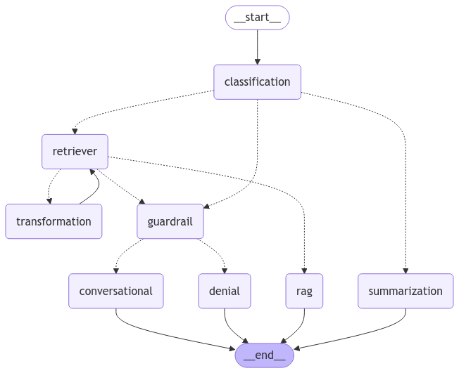

# Ombibot V2

Made in collaboration with [Drake9098](https://github.com/Drake9098)

This repository contains the code for the new version of [OmniBot](https://github.com/GiuseppeBellamacina/OmniBot), a chatbot that uses a customized version of the **RAG** model to generate responses.

For more information about its implementation details, please see the repository of the original OmniBot linked above.

The chatbot is built using the **Langchain** framework, which is designed for building conversational AI models, and **LangGraph**, a framework for creating graph-based AI applications.

No data of any kind is included, so you will need to provide your own data.

## GraphOfThoughts

# New Features

- **GraphOfThoughts**: A novel way to represent the chatbot's knowledge graph, enabling more efficient and effective information retrieval. The graph is constructed using the **LangGraph** framework and serves as the chatbot's knowledge base.

- **TTS**: The chatbot now supports text-to-speech (TTS), allowing it to vocalize its responses instead of merely displaying them as text. This feature is implemented using the **TTS** library in Python.

- **Customizable**: The chatbot offers enhanced customization options. You can easily modify how it responds to questions, retrieves information from the knowledge graph, and generates speech from text.

- **Multi-Process Elaboration**: The chatbot employs a multi-process approach to handle tasks concurrently. It can generate responses using the LLM while simultaneously producing audio output with TTS, resulting in faster and more seamless interactions.
